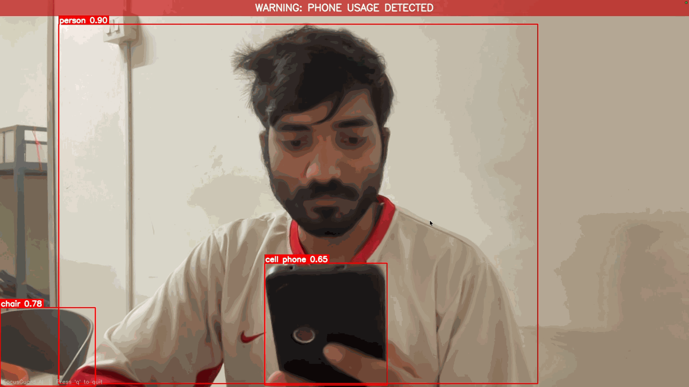

# FocusGuard AI — Real-Time Phone Usage Detection System



FocusGuard AI is a real-time computer vision system that detects mobile phone usage in front of a webcam and triggers immediate alerts. The system uses YOLOv8 object detection with OpenCV to monitor a live camera stream and identify when a **person** and a **mobile phone** appear simultaneously in the frame, indicating potential distraction.

FocusGuard AI is designed as a clean, production-style reference implementation demonstrating how to build a real-time monitoring pipeline using modern computer vision tools.

---

## Project Overview

FocusGuard AI continuously processes frames from a webcam and performs AI-based object detection to identify:

- **Person** — presence in frame
- **Cell phone** — mobile device in frame

When both are detected within the same frame, the system:

- Triggers a warning sound
- Displays a visual alert overlay (bounding boxes and on-screen notification)
- Captures a timestamped evidence screenshot
- Updates session statistics

The project emphasizes clarity, modular design, and real-world practicality, making it ideal for learning, demonstrations, and portfolio presentation.

---

## Key Features

| Feature | Description |
|--------|-------------|
| **Real-time detection** | Continuous webcam monitoring with live object detection |
| **YOLOv8 inference** | Lightweight YOLOv8n model optimized for CPU execution |
| **Dual detection logic** | Alerts trigger only when both person and cell phone are detected |
| **Audio warning** | Immediate sound alert using pygame |
| **Visual alerts** | Bounding boxes and on-screen notification when phone usage is detected |
| **Evidence capture** | Automatic screenshot logging for each detection event |
| **Alert cooldown** | Configurable delay to prevent repeated alert spam |
| **Session statistics** | Tracks frames processed, alert count, and session duration |

---

## Use Cases

FocusGuard AI can serve as a foundation for several practical applications:

| Use case | Description |
|----------|-------------|
| **Productivity monitoring** | Detect phone distractions while studying or working |
| **Educational demonstrations** | Showcase a complete AI → detection → action pipeline |
| **Research prototypes** | Build experiments involving real-time computer vision |
| **Compliance monitoring** | Adapt the framework for supervised environments |

---

## Project Structure

```text
focusguard-ai/
│
├── app.py                  # Application entry point
├── requirements.txt
├── README.md
│
├── config/
│   └── settings.py         # Adjustable runtime parameters
│
├── core/
│   ├── detector.py         # YOLOv8 model loading and inference
│   ├── logic.py            # Detection decision logic
│   └── monitoring.py       # Webcam capture and processing loop
│
├── utils/
│   ├── audio_alert.py      # Alert sound management
│   ├── evidence_saver.py   # Screenshot capture utilities
│   └── stats.py            # Session statistics tracking
│
├── assets/
│   └── alert.wav           # Warning sound
│
├── evidence/               # Saved detection screenshots (git-ignored)
│
└── models/                 # Optional model storage
```

**Module responsibilities:**

- **Detector** → AI inference
- **Logic** → Alert decisions
- **Monitoring** → Camera loop
- **Utilities** → Alerts, evidence, statistics

---

## Quick Start

### 1. Clone the repository

```bash
git clone https://github.com/<your-username>/focusguard-ai.git
cd focusguard-ai
```

### 2. Create a virtual environment

```bash
python3 -m venv venv
```

Activate it:

- **macOS / Linux:** `source venv/bin/activate`
- **Windows:** `venv\Scripts\activate`

### 3. Install dependencies

```bash
pip install -r requirements.txt
```

On the first run, the YOLOv8 nano model (`yolov8n.pt`) will automatically download.

### 4. Start the monitoring system

```bash
python app.py
```

Press **q** in the camera window to stop the system and display session statistics.

---

## Configuration

Runtime settings are defined in `config/settings.py`.

**Example configuration:**

```python
CONFIDENCE_THRESHOLD = 0.5
ALERT_COOLDOWN = 5
SAVE_EVIDENCE = True
CAMERA_INDEX = 0
MODEL_NAME = "yolov8n.pt"
```

**Configuration reference:**

| Setting | Description |
|---------|-------------|
| `CONFIDENCE_THRESHOLD` | Minimum detection confidence (0.0–1.0) |
| `ALERT_COOLDOWN` | Delay in seconds between alerts |
| `SAVE_EVIDENCE` | Enable or disable screenshot saving |
| `CAMERA_INDEX` | Webcam device index (0 = default) |
| `MODEL_NAME` | YOLOv8 model filename |

---

## System Architecture

```text
Webcam (OpenCV)
        │
        ▼
   Frame Capture
        │
        ▼
YOLOv8 Object Detection
        │
        ▼
  Detection Logic
 (person + phone?)
        │
   ┌────┴────────────┐
   ▼                 ▼
Audio Alert      Evidence Capture
(pygame)         (cv2.imwrite)
        │
        ▼
Session Statistics
```

The architecture is intentionally simple and modular, making it easy to extend with additional features.

---

## Evidence Logging

When `SAVE_EVIDENCE` is enabled, screenshots are stored in the `evidence/` directory.

**Example layout:**

```text
evidence/
├── phone_usage_2026-03-10_14-32-15.png
└── phone_usage_2026-03-10_14-35-42.png
```

**Typical uses:**

- Reviewing distraction events
- Building training datasets
- Evaluating detection accuracy

---

## Example Session Output

```text
========================================
   FocusGuard AI — Phone Usage Monitor
========================================

[Detector] Loading model: yolov8n.pt
[Monitor]  Camera started.
[Monitor]  Press 'q' to quit.

[Logic]    Phone usage detected — triggering alert.
[Evidence] Screenshot saved → evidence/phone_usage_2026-03-10_14-32-15.png

==========================================
        FocusGuard AI — Session Stats
==========================================
Frames Processed : 1420
Phone Alerts     : 3
Session Duration : 2m 32s
==========================================
```

---

## Performance

Typical performance on a standard laptop:

| Metric | Value |
|--------|-------|
| Target FPS | 30 |
| Typical CPU FPS | 15–25 |
| Model size | ~6 MB |
| RAM usage | ~300 MB |

**For improved performance:**

- Use GPU acceleration (CUDA if available)
- Reduce frame resolution in settings
- Use a lighter model variant if available

---


## Acknowledgements

- [Ultralytics YOLOv8](https://github.com/ultralytics/ultralytics)
- [OpenCV](https://opencv.org/)
- [COCO Dataset](https://cocodataset.org/) for pre-trained detection classes
